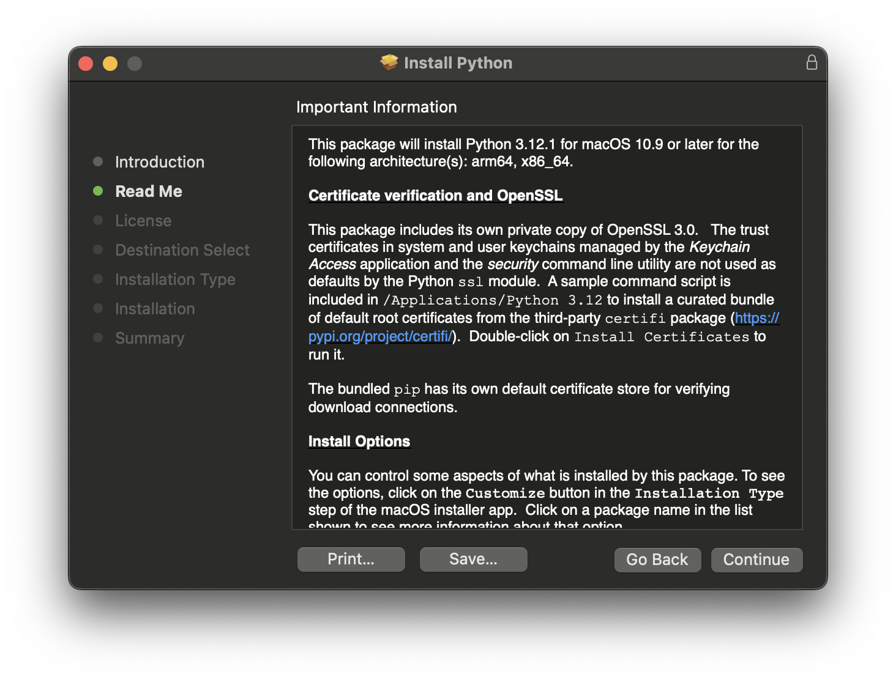
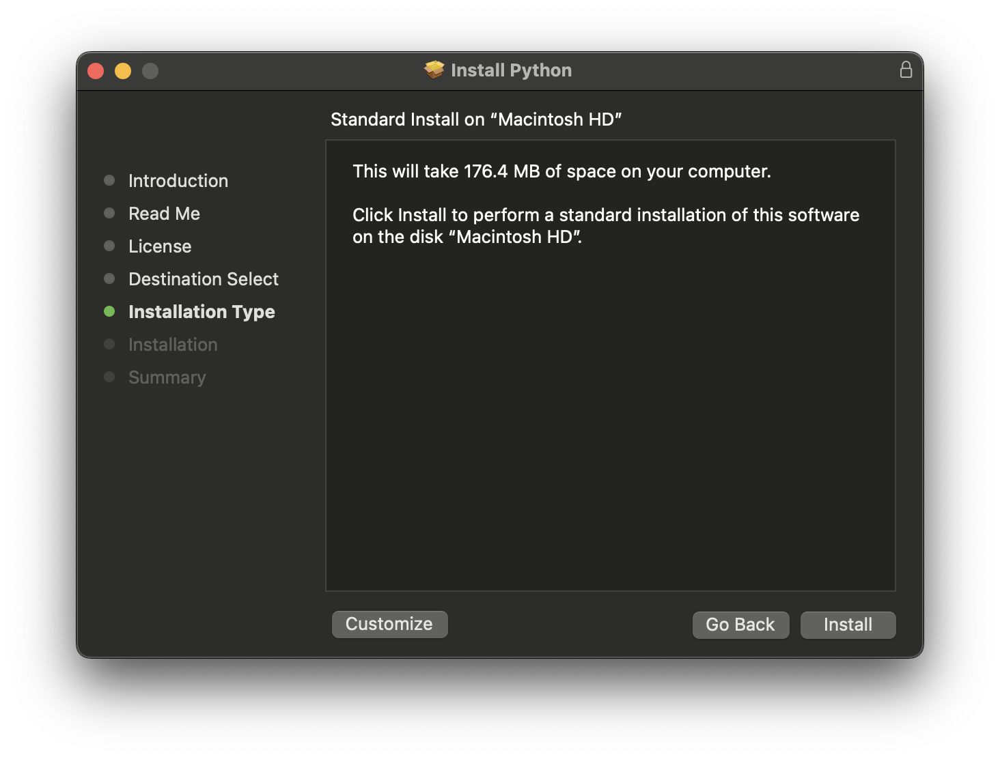

# Install Python 3.12

## Installing Python 3.12 on Windows

Installing Python on Windows is a simple and easy to follow process.

- The first thing we must do is download the installer from the official [Python](https://www.python.org/downloads/)

  

- Execute the installer.

  

  - Check the **Add Python 3.12 to PATH** to use Python on the CMD an Windows PowerShell.
  - Select **Customize installation** and be sure the *pip* option is checked. *pip* will help us to install libraries for Python.

  

  - Select the install location.

  

  - And proceed to install.

  

  - Once installed you can close the installer.
  - Test if Python is installed.
    - The installer will leave us these 4 programs.
    - The first is a Python terminal the others are documentation and help

  

  - Open Python 3.12 (64-bit)

  

  - To test if the PATH was added correctly we will open PowerShell.

    

  - Once open type ```python```  this should display information on the python version and a prompt similar to the previous console.

## Installing Python 3.12 on Mac

Installing Python on Windows is a simple and easy to follow process.

- The first thing we must do is download the installer from the official [Python](https://www.python.org/downloads/)
- Execute the installer and follow the instructions.








- Test if Python is correctly installed.
  - Open the terminal and type python3.12
  
```
python3.12 
```


## Installing Python 3.12 on Ubuntu with Apt

Installing Python 3.12 on Ubuntu with apt is a relatively straightforward process and takes only a few minutes to complete.

Update the packages list and install the prerequisites:

```
sudo apt update
sudo apt install software-properties-common
```

Add the deadsnakes PPA to your system’s sources list:

```
sudo add-apt-repository ppa:deadsnakes/ppa
```

When prompted, press `[enter/return]` to continue.

Once the repository is enabled, you can install Python 3.12 by executing:

```
sudo apt install python3.12
```

Verify that the installation was successful by typing:

```
python3.12 --version
Python 3.12.1
```

That’s it. Python 3.12 is installed on your Ubuntu, and you can start using it.
