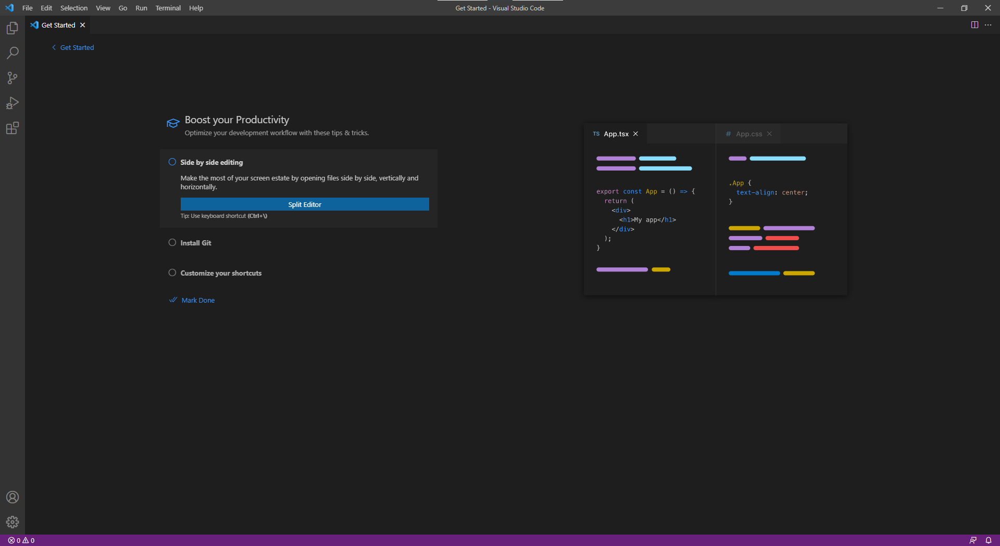

# Installing VSCode

- Download executable from the [VSCode Official Website](https://code.visualstudio.com/)
  - 

- Execute the installer and follow the instructions:
  - 
  - 
  - If you want you can check the **Open with Code** options to open files and directories from the file explorer.
  - 
  - 
  - 
  - 
- And it's done we can open VSCode now.
  - 
  - Also you can login with your GitHub account for sync your settings.
  - 
- For installation on Mac and Linux the process is similar.
