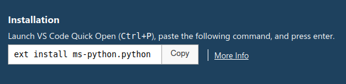
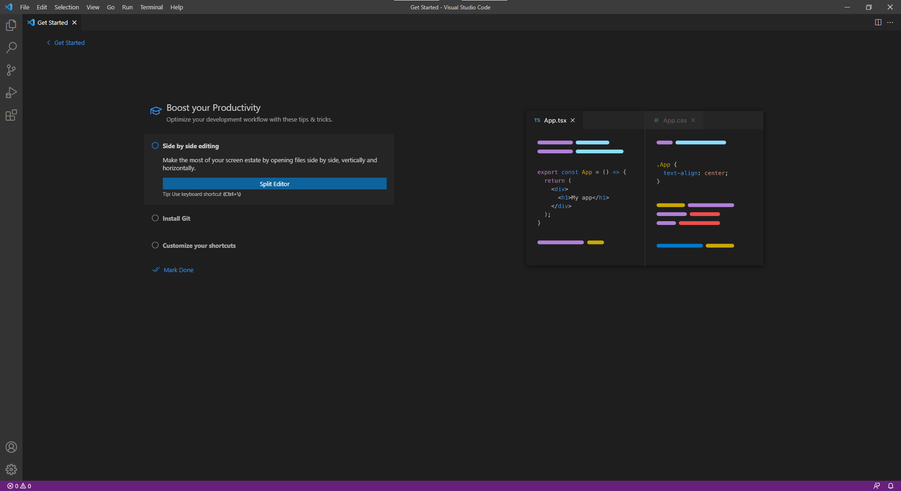
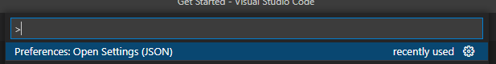
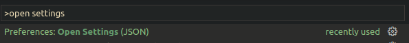
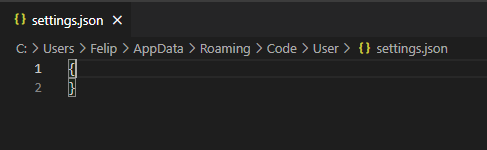

# VSCode Python Development Configuration

## VSCode Extensions

- To install these extensions open VSCode and click on the ***VS Marketplace Link***.
- Copy the extension command showed in the website:
  - 
- Open the command palette with any of the following key combinations:
  - <kbd> F1</kbd>
  - <kbd> CTRL</kbd>+<kbd>SHIFT</kbd>+<kbd>P</kbd>
  - <kbd> SHIFT</kbd>+<kbd>COMMAND</kbd>+<kbd>P</kbd>
- Paste the copied command and type <kbd>ENTER</kbd> to install the extensions

### Python

- **Name**: Python
- **Id**: ms-python.python
- **Description**: IntelliSense (Pylance), Linting, Debugging (multi-threaded, remote), Jupyter Notebooks, code formatting, refactoring, unit tests, and more.
- **Version**: 2022.0.1814523869 or Current
- **Publisher**: Microsoft
- **VS Marketplace Link**: [Python](https://marketplace.visualstudio.com/items?itemName=ms-python.python)

### Pylance

- **Name**: Pylance
- **Id**: ms-python.vscode-pylance
- **Description**: A performant, feature-rich language server for Python in VS Code
- **Version**: 2022.2.3 or Current
- **Publisher**: Microsoft
- **VS Marketplace Link**: [Pylance](https://marketplace.visualstudio.com/items?itemName=ms-python.vscode-pylance)

### Markdownlint

- **Name**: markdownlint
- **Id**: DavidAnson.vscode-markdownlint
- **Description**: Markdown linting and style checking for Visual Studio Code
- **Version**: 0.46.0 or Current
- **Publisher**: David Anson
- **VS Marketplace Link**: [markdownlint](https://marketplace.visualstudio.com/items?itemName=DavidAnson.vscode-markdownlint)

### Markdown Preview Github Styling

- **Name**: Markdown Preview Github Styling
- **Id**: bierner.markdown-preview-github-styles
- **Description**: Changes VS Code's built-in markdown preview to match Github's style
- **Version**: 1.0.1 or Current
- **Publisher**: Matt Bierner
- **VS Marketplace Link**: [Markdown Preview Github Styling](https://marketplace.visualstudio.com/items?itemName=bierner.markdown-preview-github-styles)

### Tabnine AI

- **Name**: Tabnine AI Autocomplete for JavaScript, Python, Typescript, PHP, Go, Java, Ruby & more
- **Id**: Heartburning-vscode
- **Description**: JavaScript, Python, Java, Typescript & all other languages - AI Code completion plugin. Tabnine makes developers more productive by auto-completing their code.
- **Version**: 3.5.26 or Current
- **Publisher**: TabNine
- **VS Marketplace Link**: [Tabnine AI](https://marketplace.visualstudio.com/items?itemName=TabNine.tabnine-vscode)

## Themes I'm using in VSCode

### Gruvbox Theme

- **Name**: Gruvbox Theme
- **Id**: jdinhlife.gruvbox
- **Description**: Gruvbox Theme
- **Version**: 1.5.1 or Current
- **Publisher**: jdinhlife
- **VS Marketplace Link**: [Gruvbox Theme](https://marketplace.visualstudio.com/items?itemName=jdinhlife.gruvbox)

### Material Icon Theme

- **Name**: Material Icon Theme
- **Id**: PKief.material-icon-theme
- **Description**: Material Design Icons for Visual Studio Code
- **Version**: 4.13.0 or Current
- **Publisher**: Philipp Kief
- **VS Marketplace Link**: [Material Icon Theme](https://marketplace.visualstudio.com/items?itemName=PKief.material-icon-theme)

## VSCode Settings

To configure our VSCode environment we need to overwrite the VSCode settings.json file.

- Open VSCode:

- Open the command palette with any of the following key combinations:
  - <kbd> F1</kbd>
  - <kbd> CTRL</kbd>+<kbd>SHIFT</kbd>+<kbd>P</kbd>
  - <kbd> SHIFT</kbd>+<kbd>COMMAND</kbd>+<kbd>P</kbd>
- The command palette looks like this:

- Type ``open settings`` to find the command that opens the settings JSON file:
  - And select ``Preferences: Open Settings (JSON)``

- And then the editor will open the configuration file:

  

- The configuration file can be empty or with an old default configuration. Then we need to copy the following file to get a better experience for the class:
  - [VSCode Settings JSON File](src/settings.json)
