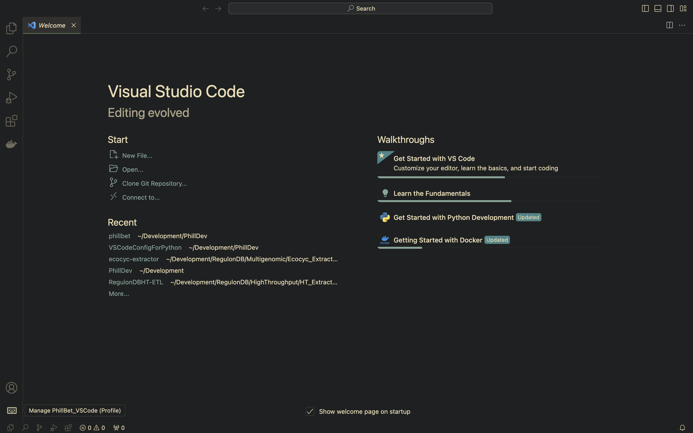
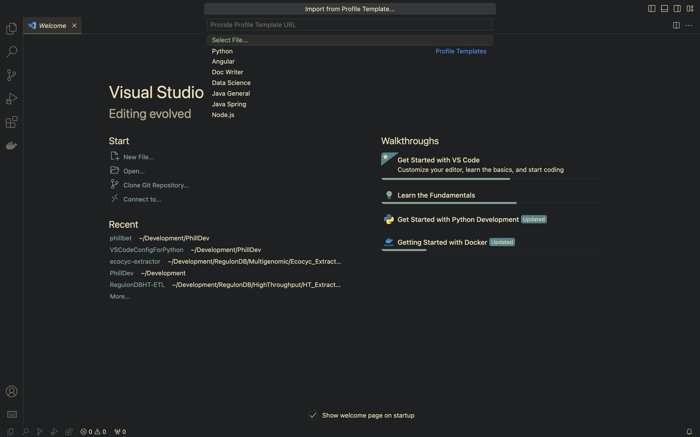
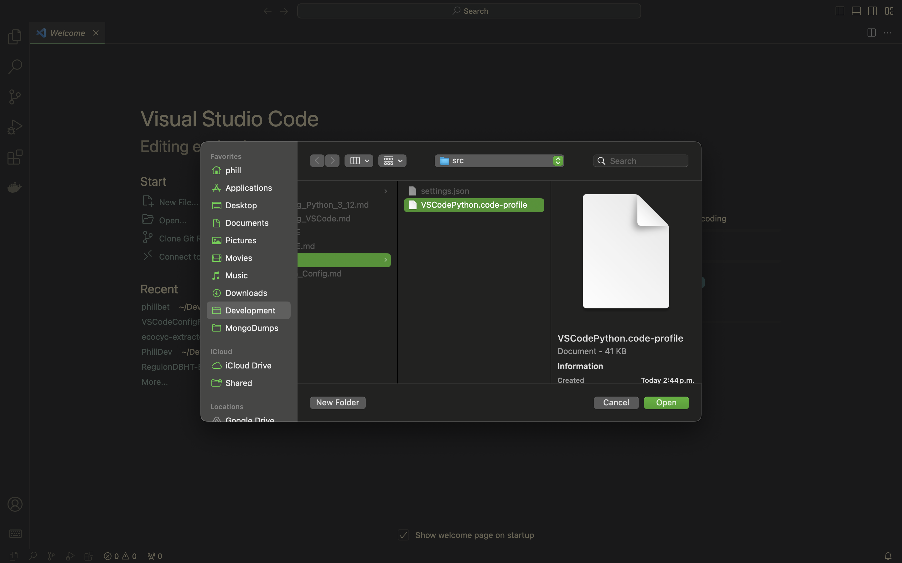
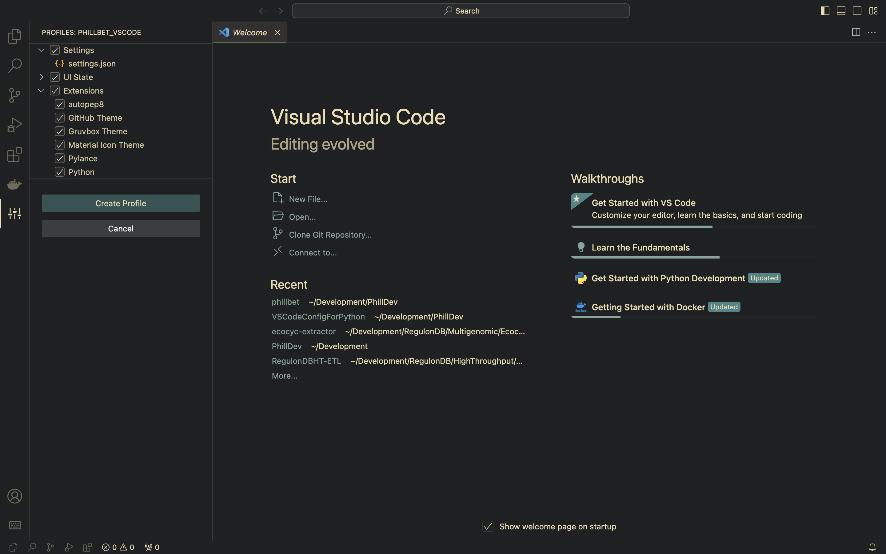
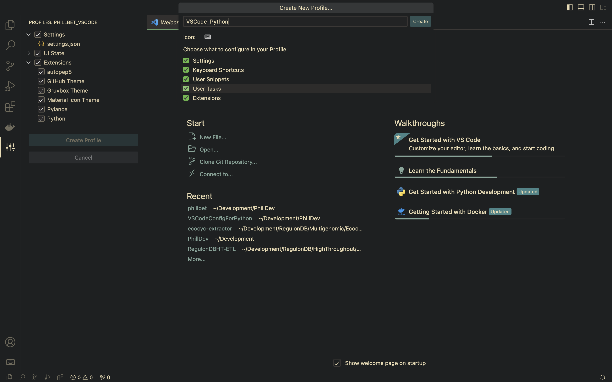

# VSCode Python Development Configuration

## Quick Configuration
- If you want to use this recommended environment configuration follow next steps.

- Open VS Code and click on Manage icon down left in the editor (⚙️ Gear Icon):
  - 

- Select option `Select File`:
  - 

- Select file stored in this GitHub repository [`VSCodePython.code-profile`](src/VSCodePython.code-profile):
  - 

- Click on `Create Profile`:
  - 

- Set a name for your new profile and click on `Create`:
  - 

- Maybe VSCode needs to be reloaded. 
- Now you can use your VSCode for Python development 🐍.

---
### Next sections expands on detail what we are doing.
---
## VSCode Extensions

- To install these extensions open VSCode and click on the ***VS Marketplace Link***.
- Copy the extension command showed in the website:
  - 
- Open the command palette with any of the following key combinations:
  - <kbd> F1</kbd>
  - <kbd> CTRL</kbd>+<kbd>SHIFT</kbd>+<kbd>P</kbd>
  - <kbd> SHIFT</kbd>+<kbd>COMMAND</kbd>+<kbd>P</kbd>
- Paste the copied command and type <kbd>ENTER</kbd> to install the extensions

### Python

- **Name**: Python
- **Id**: ms-python.python
- **Description**: IntelliSense (Pylance), Linting, Debugging (multi-threaded, remote), Jupyter Notebooks, code formatting, refactoring, unit tests, and more.
- **Version**: 2022.0.1814523869 or Current
- **Publisher**: Microsoft
- **VS Marketplace Link**: [Python](https://marketplace.visualstudio.com/items?itemName=ms-python.python)

### Pylance

- **Name**: Pylance
- **Id**: ms-python.vscode-pylance
- **Description**: A performant, feature-rich language server for Python in VS Code
- **Version**: 2022.2.3 or Current
- **Publisher**: Microsoft
- **VS Marketplace Link**: [Pylance](https://marketplace.visualstudio.com/items?itemName=ms-python.vscode-pylance)

### autopep8

- **Name**: autopep8
- **Id**: ms-python.autopep8
- **Description**: Formatting support for Python files using the autopep8 formatter.
- **Version**: 2023.8.0 or Current
- **Publisher**: Microsoft
- **VS** Marketplace Link: [autopep8](https://marketplace.visualstudio.com/items?itemName=ms-python.autopep8)

## Themes I'm using in VSCode

### Gruvbox Theme

- **Name**: Gruvbox Theme
- **Id**: jdinhlife.gruvbox
- **Description**: Gruvbox Theme
- **Version**: 1.5.1 or Current
- **Publisher**: jdinhlife
- **VS Marketplace Link**: [Gruvbox Theme](https://marketplace.visualstudio.com/items?itemName=jdinhlife.gruvbox)

### Material Icon Theme

- **Name**: Material Icon Theme
- **Id**: PKief.material-icon-theme
- **Description**: Material Design Icons for Visual Studio Code
- **Version**: 4.13.0 or Current
- **Publisher**: Philipp Kief
- **VS Marketplace Link**: [Material Icon Theme](https://marketplace.visualstudio.com/items?itemName=PKief.material-icon-theme)

## VSCode Settings

Also we can configure our VSCode environment by overwriting the VSCode settings.json file.

- Open VSCode:

- Open the command palette with any of the following key combinations:
  - <kbd> F1</kbd>
  - <kbd> CTRL</kbd>+<kbd>SHIFT</kbd>+<kbd>P</kbd>
  - <kbd> SHIFT</kbd>+<kbd>COMMAND</kbd>+<kbd>P</kbd>
- The command palette looks like this:

- Type ``open settings`` to find the command that opens the settings JSON file:
  - And select ``Preferences: Open Settings (JSON)``

- And then the editor will open the configuration file:

  

- The configuration file can be empty or with an old default configuration. Then we need to copy the following file to get a better experience for the class:
  - [VSCode Settings JSON File](src/settings.json)
